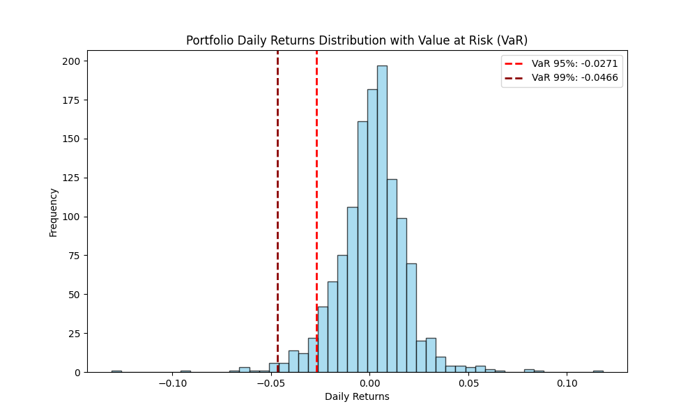

# 📈 Portfolio Risk Analysis  

This project applies **quantitative finance techniques** to analyze the risk of a stock portfolio using Python. It covers **return calculation, volatility, Sharpe Ratio, and Value at Risk (VaR)** to provide insights into portfolio performance and downside risk.  

---

## 🚀 Features
- Fetches **historical stock price data** using `yfinance`.  
- Calculates **daily & annualized returns and volatility**.  
- Computes **Sharpe Ratio** for risk-adjusted performance.  
- Implements **Historical Value at Risk (VaR)** at 95% and 99% confidence levels.  
- Generates **visualizations** (distribution of returns with VaR cutoffs).  

---

## 🛠️ Tech Stack
- **Python 3.11+**  
- **Libraries:**  
  - `pandas` → data manipulation  
  - `numpy` → numerical calculations  
  - `yfinance` → stock data download  
  - `matplotlib` → visualization  

---

## 📊 Methodology
1. **Data Collection**  
   - Used `yfinance` to pull stock prices (e.g., Apple, Microsoft, Google) from 2020–2024.  

2. **Portfolio Returns**  
   - Calculated daily returns and combined them into a weighted portfolio.  

3. **Risk & Performance Metrics**  
   - **Annualized Return**: Average yearly growth.  
   - **Annualized Volatility**: Standard deviation of returns scaled to yearly level.  
   - **Sharpe Ratio**: Measures excess return per unit of risk.  

4. **Value at Risk (VaR)**  
   - Applied **Historical Simulation** method.  
   - Identified the **5th percentile (95% VaR)** and **1st percentile (99% VaR)** of returns.  

---

## 📉 Results

- **Annual Return**: 0.27%  
- **Annual Volatility**: 0.2839%  
- **Sharpe Ratio**: 0.9511  
- **VaR (95%)**: With 95% confidence, losses will not exceed *2.71%* in one day.  
- **VaR (99%)**: With 99% confidence, losses will not exceed *4.66%* in one day.  

### Visualization
  

👤 Author

Kushagra Shrivastava
  
